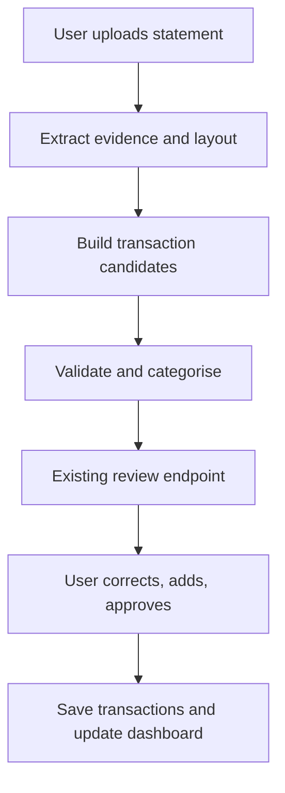

# Bank Statement Transaction Extraction: Updated Integration Plan

## Product context

The web app already supports this user journey:

1. A user uploads a bank statement.
2. Extracted transactions are sent to the existing review endpoint.
3. The user reviews the spending category and whether each transaction is credit or debit; they can add a missing transaction manually.
4. The user approves the reviewed transactions.
5. Approved transactions are inserted into the database and the dashboard charts update.

The problem is upstream extraction accuracy. Too many malformed, incomplete, or wrongly assigned transaction rows make the existing review experience slow.

## Goal

Improve the extraction stage so the current review endpoint receives a small, trustworthy set of transaction candidates with evidence, confidence, and clear reasons for uncertainty.

The system should support varying digital-PDF bank-statement layouts without fixed DBS coordinates. It must preserve the user's existing final approval authority.

## Core decision

Use a **native-first, vision-assisted extraction pipeline**.

- Native PDF text is the preferred source of exact values when a PDF has selectable text.
- OCR is a fallback for a page whose native text is missing or unusable, and an optional second check for suspicious values.
- A vision-capable LLM identifies the transaction-table area and the meaning of a statement's columns.
- Deterministic coordinate-based code reconstructs rows and extracts amounts.
- A separate LLM call proposes categories and normalises descriptions; it must not be allowed to invent, move, or change financial amounts.
- The existing review endpoint remains the place where the user confirms, corrects, adds, and approves transactions.

This is preferable to sending flattened PDF text straight to one LLM, which loses layout and makes debit/credit decisions unreliable.

## Updated user flow



The important change is that `D` attaches confidence and source evidence before the review page opens. It does not bypass the review-and-approval flow.

## Canonical candidate contract

Extend the payload sent to the review endpoint. Keep money as decimal strings until database insertion.

```json
{
  "candidate_id": "uuid",
  "statement_id": "uuid",
  "account_id": "uuid-or-null",
  "page_number": 2,
  "row_index": 4,
  "date": "2026-05-26",
  "description": "Funds Transfer FT260526MB51530495 072-015077-5:IB",
  "debit": "500.00",
  "credit": null,
  "balance": "330.27",
  "currency": "SGD",
  "suggested_category": "Transfer",
  "category_confidence": 0.91,
  "extraction_confidence": 0.97,
  "validation_status": "validated",
  "review_reasons": [],
  "source_text": "...",
  "source_bboxes": [],
  "extraction_method": "native"
}
```

Use separate fields for `debit` and `credit` internally. The UI may present a simpler `transaction_type` field, derived as follows:

```text
debit present  -> debit
credit present -> credit
both or neither -> unknown / needs user input
```

Do not rely on the category model to decide debit versus credit.

## Extraction architecture

### 1. Create page evidence

For every uploaded PDF page:

1. Render a page image at approximately 200–300 DPI.
2. Extract native words with coordinates using PyMuPDF:

   ```python
   words = page.get_text("words", sort=True)
   raw = page.get_text("rawdict", sort=True)
   ```

3. Score the quality of native text. Indicators of poor quality include very little text, replacement characters, malformed money strings, or low date/amount recognition.
4. Run OCR only when native text quality is poor, or for a targeted cross-check on low-confidence amount cells.

Keep native and OCR evidence separately. OCR should not silently overwrite native text.

### 2. Discover the transaction layout per page

Do not use hardcoded DBS x-coordinates as the primary approach. Also do not use PyMuPDF `find_tables()` as the source of truth: decorative lines and coloured row backgrounds can create incorrect columns.

Send a vision-capable LLM:

- the rendered page image;
- a compact list of text lines, each with an ID and bounding box;
- a strict JSON-only layout task.

Example response:

```json
{
  "contains_transaction_table": true,
  "table_bbox": [40, 145, 1655, 1410],
  "header_line_ids": ["line_21"],
  "columns": [
    {"field": "date", "header_text": "Date"},
    {"field": "description", "header_text": "Description"},
    {"field": "debit", "header_text": "Withdrawal (-)"},
    {"field": "credit", "header_text": "Deposit (+)"},
    {"field": "balance", "header_text": "Balance (SGD)"}
  ],
  "currency": "SGD",
  "confidence": 0.94
}
```

The model is allowed to return `contains_transaction_table: false`, unmapped columns, or low confidence. Those pages are presented as uncertain rather than being fabricated into transactions.

### 3. Derive columns from native coordinates

Find the LLM-identified header words in native coordinate data. Sort their actual x-centres left to right and calculate boundaries at the midpoints between neighbouring headers.

This is dynamic per page:

- The LLM provides the semantic mapping: which heading means debit, credit, balance, etc.
- Native text coordinates provide the exact column locations.
- The parser then reads values within those locations.

This is a controlled generalisation, not an attempt to assume all banks look identical.

### 4. Reconstruct rows with multiple signals

Do not treat a date as the sole indicator of a new row. A candidate row should be formed from several pieces of evidence:

- vertical position inside the transaction table;
- text aligned to discovered date, description, debit, credit, or balance columns;
- date presence, where the statement includes a date per transaction;
- one or more amounts in money columns;
- vertical gaps, visual row bands, and the next likely anchor line;
- description-only continuation lines beneath a transaction;
- opening and closing balance markers.

Algorithm:

1. Cluster words into visual lines by nearby y-coordinate.
2. Assign each word to a dynamic semantic column using its x-centre.
3. Identify likely transaction anchors from the combined date, amount, balance, and position signals.
4. Append subsequent description-only lines to the preceding transaction anchor.
5. Retain incomplete/conflicting candidates with explicit review reasons; do not guess.

This supports multi-line descriptions and statements that do not repeat a date on every visual line.

### 5. Categorise after extraction

Only after a candidate transaction has been spatially reconstructed should the categorisation LLM run.

Input:

```json
{
  "date": "2026-05-26",
  "description": "7-ELEVEN - PUNGGOL S...",
  "debit": "10.00",
  "credit": null,
  "currency": "SGD"
}
```

Output:

```json
{
  "suggested_category": "Groceries",
  "confidence": 0.89,
  "reason": "Merchant appears to be a convenience store"
}
```

Category suggestions are independent of extraction validity. The user can change them in the existing review endpoint.

## Validation before review

Validation reduces needless user work and highlights genuine issues clearly.

### Field validation

- Date is parseable under a detected statement format.
- Debit, credit, and balance match a monetary pattern.
- No candidate has both debit and credit populated unless the layout explicitly supports it.
- Description contains no leaked header text or account-summary content.
- Currency is populated or explicitly `unknown`.

### Balance reconciliation

For adjacent rows where balances are available:

```python
expected_balance = previous_balance - debit + credit
is_reconciled = abs(expected_balance - current_balance) <= Decimal("0.01")
```

Handle opening and closing balances as special non-spending rows.

Balance reconciliation should flag a likely debit/credit swap or missing transaction. It must not silently alter values. The user sees the mismatch and can correct it in review.

### Missing-transaction detection

The system cannot prove an omitted row exists from text alone, but it can strongly signal one when:

- a balance reconciliation gap exists;
- a page transition balance does not connect;
- visual text exists in the table region but no candidate row was created;
- OCR/native evidence contains a plausible unmatched date or monetary value.

Pass such cases into the existing review experience as a non-transaction warning, for example:

```json
{
  "review_reason": "possible_missing_transaction",
  "page_number": 3,
  "expected_balance": "330.27",
  "observed_next_balance": "280.27",
  "difference": "50.00"
}
```

This directs the user to the relevant source region before they resort to manual transaction entry.

## Review endpoint changes

Keep the endpoint's purpose, but make it evidence-driven and prioritised.

### Review states

```text
candidate        extraction completed; not yet shown/edited
reviewed         user has checked or changed the candidate
approved         user explicitly approves; eligible for database insertion
rejected         user rejects candidate; never inserted
```

### UI behaviour

Every candidate should show:

- date, description, debit/credit, balance, and suggested category;
- a confidence indicator;
- only the relevant warning, if any;
- a crop of the source statement row when low-confidence or flagged;
- direct controls for category, debit/credit, amounts, date, description, and rejection.

Prioritise the list:

1. candidates with balance mismatches, possible missing transactions, or unclear debit/credit;
2. low-confidence extraction candidates;
3. high-confidence candidates, where a user can batch-confirm categories if the current product permits it.

High confidence must not mean auto-uploaded. It means the review UI can reduce attention spent on obvious fields while retaining the existing user approval step.

## Data model additions

Preserve your current transaction records. Add or retain an upload/session model for provisional data.

```text
statements
  id, user_id, uploaded_at, file_hash, parsing_status

statement_pages
  id, statement_id, page_number, native_quality_score, image_path

extraction_layouts
  id, statement_id, page_number, table_bbox, columns_json, model_version

transaction_candidates
  id, statement_id, page_number, row_index, date, description,
  debit, credit, balance, currency, suggested_category,
  extraction_confidence, category_confidence, validation_status,
  review_reasons_json, source_text, source_bboxes_json, extractor_version

candidate_reviews
  id, candidate_id, user_id, corrected_fields_json, approved_at, rejected_at

transactions
  approved final records used by dashboard charts
```

On approval, copy/commit the reviewed candidate into `transactions`; keep the candidate and correction history for audit and future evaluation.

## Implementation order

### Phase 0: create a test corpus

Before changing production logic, collect a small set of de-identified statements and manually record the expected transactions. Include at least several DBS periods and one materially different bank layout when available.

Measure:

- transaction row precision and recall;
- debit/credit accuracy;
- amount and date exact-match rate;
- category accuracy separately from extraction accuracy;
- balance reconciliation rate;
- percentage of candidates requiring a user correction;
- time from upload to approval.

### Phase 1: improve the existing DBS path

1. Preserve native word coordinates and source text for every extracted value.
2. Add dynamic header-coordinate discovery instead of fixed DBS page x-values.
3. Add deterministic money/date validation and balance reconciliation.
4. Add confidence and explicit review reasons to the existing review payload.
5. Show the source-row crop only for problematic candidates.

### Phase 2: introduce layout discovery

1. Add the vision-LLM layout call for unfamiliar layouts.
2. Derive column boundaries from its semantic mapping plus native word positions.
3. Keep `find_tables()` only as a non-authoritative candidate signal.
4. Store the discovered layout for the uploaded statement; do not globally hardcode it as a new bank template without evaluation.

### Phase 3: add targeted OCR

1. Implement page quality scoring.
2. OCR only poor-quality pages or disputed cells.
3. If native and OCR disagree on a critical financial field, generate a review reason rather than choosing silently.

### Phase 4: improve from real corrections

Use anonymised correction data to identify failure patterns: header mapping, row grouping, debit/credit assignment, merchant text, or category prediction. Update prompts, deterministic rules, and layout handling based on measured error types.

## Acceptance criteria

- The existing review endpoint remains the single approval gate before dashboard data changes.
- A malformed extraction never reaches the user as an unexplained row.
- Every candidate includes source evidence and validation status.
- Debit/credit is extracted from dynamic column semantics, not inferred from a flattened-text sequence.
- Possible missing rows are surfaced with a specific page/amount/balance reason.
- Category prediction cannot change amounts or debit/credit classification.
- High-confidence candidates reduce manual effort but are still approved by the user.
- The implementation can reproduce a candidate extraction from stored evidence and extractor version.

## Explicit non-goals for the first iteration

- Automatic insertion of transactions without the current user-approval step.
- A custom-trained document model before there is a representative labelled corpus.
- Claiming support for every bank or scan quality without measured tests.
- Treating an LLM-generated confidence value as sufficient validation for financial data.
